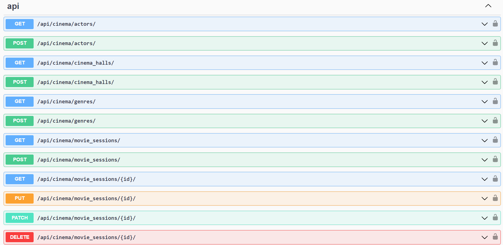
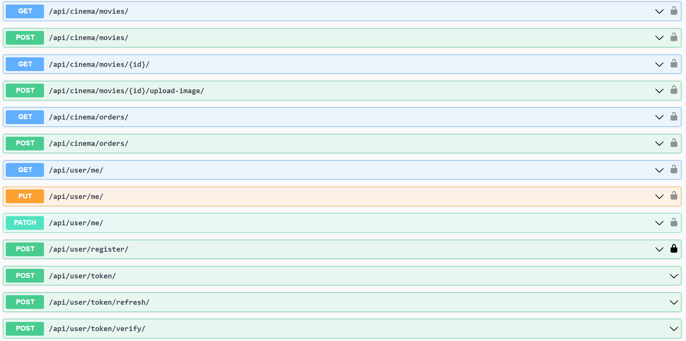

# Cinema API application

### API service for cinema management written with usage Django REST Framework

### Installing of project:

1. #### Install PostgresSQL and create db
2. #### Clone repo 

```
git clone <YOUR WAY TO CLONE>
cd cinema
python -m venv venv
```

3. #### Set Up project

- ##### Linux/macOS:
```
  source venv/bin/activate
  pip install -r requirements.txt
  export DB_HOST=<your db hostname>
  export DB_NAME=<your db name>
  export DB_USER=<your db user>
  export DB_PASSWORD=<your db password>
  export DB_SECRET_KEY=<your secret key>
```
- ##### Windows: 
```
  venv\Scripts\activate
  pip install -r requirements.txt
  set DB_HOST=<your db hostname>
  set DB_NAME=<your db name>
  set DB_USER=<your db user>
  set DB_PASSWORD=<your db password>
  set DB_SECRET_KEY=<your secret key>
```

4. #### Run server 

- ##### Run local
```
python manage.py migrate
python manage.py runserver
```
- ##### Run with docker (Docker should be installed)

```
docker-compose up
```

### Getting access

- #### create user via /api/user/register/
- #### get access token via /api/user/token/


## Features
- #### JWT authenticated
- #### Admin panel /admin/
- #### Documentation is located at /api/doc/swagger/
- #### Managing orders and tickets
- #### Creating movies with genres, actors
- #### Creating cinema halls
- #### Adding movie sessions
- #### Filtering movies and movie sessions

## API Endpoints


